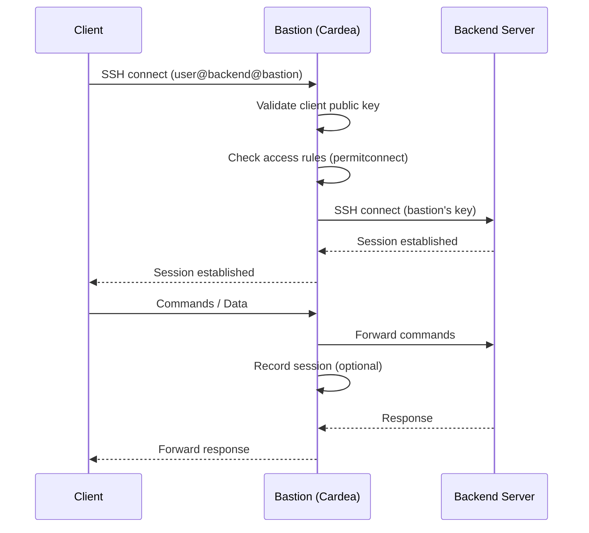

# Cardea

Cardea is an SSH bastion server with access control, session recording, and optional TPM-backed key protection.

## How it works

Clients connect to the bastion encoding the target backend in the SSH username (e.g., `user@backend@bastion`, [see format](#client-connection)). The bastion authenticates the client, verifies access rules, and connects to the backend using its own key. Sessions can optionally be recorded in [asciinema v3](https://www.asciinema.org) format.



> [!NOTE]
> The bastion's public key must be added to the backend servers' `authorized_keys`. Use [TPM mode](#tpm-mode) to protect the bastion's private key from extraction.
> The [`from` option](https://man.openbsd.org/sshd#from=_pattern-list_) can restrict backend access to the bastion's IP.

## Installation

### Docker

```sh
docker run -p '2222:2222' -u "$(id -u):$(id -g)" --mount 'type=bind,src=./data/,dst=/data/' ghcr.io/hectorm/cardea:v1
```

Images available on [GitHub Container Registry](https://github.com/hectorm/cardea/pkgs/container/cardea) and [Docker Hub](https://hub.docker.com/r/hectorm/cardea).

### Prebuilt binaries

Download from the [releases page](https://github.com/hectorm/cardea/releases). Builds are reproducible, immutable, and include [provenance attestation](https://docs.github.com/en/actions/concepts/security/artifact-attestations).

## Configuration

### Command-line options

```
-listen string
      address for SSH server (env CARDEA_LISTEN) (default ":2222")
-health-listen string
      address for health/metrics server; disabled if empty (env CARDEA_HEALTH_LISTEN) (default "localhost:9222")
-key-strategy string
      key strategy for bastion host/backend authentication: file, tpm (env CARDEA_KEY_STRATEGY) (default "file")
-private-key-file string
      path to the host private key (env CARDEA_PRIVATE_KEY_FILE) (default "/etc/cardea/private_key")
-private-key-passphrase string
      passphrase for the private key (env CARDEA_PRIVATE_KEY_PASSPHRASE)
-private-key-passphrase-file string
      path to file containing the private key passphrase (env CARDEA_PRIVATE_KEY_PASSPHRASE_FILE)
-tpm-device string
      path to the TPM device (env CARDEA_TPM_DEVICE) (default "/dev/tpmrm0")
-tpm-parent-handle string
      persistent handle for the parent key (e.g. 0x81000001); if not set, a transient key is created (env CARDEA_TPM_PARENT_HANDLE)
-tpm-parent-auth string
      authorization value for the parent key (env CARDEA_TPM_PARENT_AUTH)
-tpm-parent-auth-file string
      path to file containing the parent key authorization (env CARDEA_TPM_PARENT_AUTH_FILE)
-tpm-key-file string
      path to the key blob (env CARDEA_TPM_KEY_FILE) (default "/etc/cardea/tpm_key.blob")
-tpm-key-auth string
      authorization value for the key (env CARDEA_TPM_KEY_AUTH)
-tpm-key-auth-file string
      path to file containing the key authorization (env CARDEA_TPM_KEY_AUTH_FILE)
-authorized-keys-file string
      path to the authorized keys file (env CARDEA_AUTHORIZED_KEYS_FILE) (default "/etc/cardea/authorized_keys")
-known-hosts-file string
      path to the known hosts file (env CARDEA_KNOWN_HOSTS_FILE) (default "/etc/cardea/known_hosts")
-unknown-hosts-policy string
      policy for unknown hosts: strict (deny unknown), tofu (trust on first use) (env CARDEA_UNKNOWN_HOSTS_POLICY) (default "strict")
-connections-max int
      maximum number of concurrent connections; 0 for unlimited (env CARDEA_CONNECTIONS_MAX) (default 1000)
-rate-limit-max int
      maximum number of unauthenticated requests per IP address; 0 for unlimited (env CARDEA_RATE_LIMIT_MAX) (default 10)
-rate-limit-time duration
      time window for rate limiting unauthenticated requests (env CARDEA_RATE_LIMIT_TIME) (default 5m0s)
-recordings-dir string
      directory to store session recordings; disabled if empty (env CARDEA_RECORDINGS_DIR)
-recordings-retention-time duration
      time to retain session recordings (env CARDEA_RECORDINGS_RETENTION_TIME) (default 720h0m0s)
-recordings-max-disk-usage string
      maximum disk usage for session recordings; accepts percentage (e.g. 90%) or fixed size (e.g. 1GB) (env CARDEA_RECORDINGS_MAX_DISK_USAGE) (default "90%")
-log-level string
      log level: debug, info, warn, error, quiet (env CARDEA_LOG_LEVEL) (default "info")
-version
      show version and exit
```

### Authorized keys format

Cardea uses a variation of the SSH authorized keys format to define access rules and options for each key.

```sh
permitconnect="user1@host1:port1,user2@host2:port2",permitopen="host1:port1,host2:port2",command="cmd",no-pty,no-port-forwarding ssh-ed25519 AAAAC3NzaC1lZDI1NTE5...
```

#### Required

- **`permitconnect`**: comma-separated list of allowed backend server connections (can be specified multiple times).
  - **Format:** `<user>@<host>[:<port>]` or `<user>+<host>[+<port>]`, where `<user>` is the backend server username.
  - Supports glob patterns (defined by the [Go `filepath.Match` function](https://pkg.go.dev/path/filepath#Match)) for users.
  - Supports glob patterns and CIDR blocks for hosts.
  - Supports glob patterns and ranges (e.g., `8000-8999`) for ports.
  - If no port is specified, the default SSH port (22) is used.
  - If multiple `permitconnect` options for the same public key are present, the first match is used and the options specified in that match are applied.
  - **Example:** `permitconnect="alice@*.internal,alice@10.0.0.0/16"`.

#### Optional

- **`permitopen`**: comma-separated list of allowed local port forwarding destinations (can be specified multiple times).
  - **Format:** `<host>:<port>`.
  - Supports glob patterns and CIDR blocks for hosts.
  - Supports glob patterns and ranges (e.g., `8000-8999`) for ports.
  - By default, only localhost traffic to any port is allowed.
  - **Example:** `permitopen="localhost:1-65535,127.0.0.1/8:1-65535,[::1/128]:1-65535"`.
- **`permitlisten`**: comma-separated list of allowed remote port forwarding bind addresses (can be specified multiple times).
  - **Format:** `<host>:<port>`.
  - Supports glob patterns and CIDR blocks for hosts.
  - Supports glob patterns and ranges (e.g., `8000-8999`) for ports.
  - By default, remote port forwarding is disabled.
  - **Example:** `permitlisten="localhost:8080,0.0.0.0:8000-8999"`.
- **`command`**: force execution of a specific command.
  - **Example:** `command="nologin"`.
- **`no-pty`**: disable pseudo-terminal allocation.
- **`no-port-forwarding`**: disable both local and remote port forwarding.

#### Extensions

The format supports comments, directives, line continuation, and pipe expansion:

- **`#`**: comment (at line start or end of line).
- **`\`**: joins the next line (must immediately precede the newline).
- **`|`**: allows multiple keys to share the same options (e.g., `permitconnect="..." KEY1 | KEY2 | KEY3`).

**Directives:**

- **`#define NAME value`**: defines a macro (`[A-Za-z_][A-Za-z0-9_]*`) that is expanded everywhere, including inside quoted values.

**Example:**

```sh
# === Keys ===
#define ALICE_KEY ssh-ed25519 AAAAC3NzaC1lZDI1NTE5... alice@example.com
#define BOB_KEY ssh-ed25519 AAAAC3NzaC1lZDI1NTE5... bob@example.com
#define CAROL_KEY ssh-ed25519 AAAAC3NzaC1lZDI1NTE5... carol@example.com
#define DAVE_KEY ssh-ed25519 AAAAC3NzaC1lZDI1NTE5... dave@example.com
#define CI_KEY ssh-ed25519 AAAAC3NzaC1lZDI1NTE5... deploy@ci

# === Teams ===
#define SRE_TEAM ALICE_KEY | BOB_KEY
#define DEV_TEAM CAROL_KEY | DAVE_KEY
#define ALL_TEAMS SRE_TEAM | DEV_TEAM

# === Servers ===
#define DEV_SERVERS *@dev.example.com:22
#define STAGING_SERVERS *@staging.example.com:22
#define PROD_SERVERS \
  # web server
  *@example.com:22, \
  # API server
  *@api.example.com:22

# === Server groups ===
#define NON_PROD_SERVERS DEV_SERVERS,STAGING_SERVERS
#define ALL_SERVERS NON_PROD_SERVERS,PROD_SERVERS

# === Option templates ===
#define SFTP_OPTS command="internal-sftp",no-pty

# === Access rules ===

# SRE: full access to all servers
permitconnect="ALL_SERVERS",permitopen="*:*" SRE_TEAM

# Developers: non-production environments only
permitconnect="NON_PROD_SERVERS" DEV_TEAM

# CI/CD: SFTP-only deploy to production
permitconnect="PROD_SERVERS",SFTP_OPTS CI_KEY

# Git: repository access for everyone
permitconnect="*@git.example.com:22" ALL_TEAMS | CI_KEY
```

### Known hosts format

Cardea uses the standard OpenSSH known hosts format to verify backend server host keys when connecting from the bastion to backend servers.

```sh
[host]:port ssh-ed25519 AAAAC3NzaC1lZDI1NTE5...
```

#### Unknown hosts policy

The `--unknown-hosts-policy` option controls how Cardea handles connections to backend servers whose host key is not present in the known hosts file.

- **`strict` (default):** reject connections to unknown hosts. The connection fails if the backend server's host key is not in the known hosts file or does not match.
- **`tofu` (trust on first use):** automatically add unknown host keys to the known hosts file on first connection. Subsequent connections are verified against the stored key. When a new host is trusted, a warning is logged with the fingerprint and public key.

> [!NOTE]
> TOFU is convenient but vulnerable to man-in-the-middle attacks on first connection. Use `strict` mode in production environments where backend host keys can be pre-populated.

#### Certificate authority

Cardea supports `@cert-authority` entries for SSH certificate-based host verification, allowing backend servers to present certificates signed by a trusted CA instead of requiring individual host keys. Host patterns support wildcards (e.g., `*`, `*.internal`, `*:22`).

**Example:**

```sh
# Trust individual host keys
[10.0.1.1]:22 ssh-ed25519 AAAAC3NzaC1lZDI1NTE5...
[10.0.1.2]:22 ssh-ed25519 AAAAC3NzaC1lZDI1NTE5...

# Trust a CA for all backend servers on port 22
@cert-authority *:22 ssh-ed25519 AAAAC3NzaC1lZDI1NTE5...

# Trust a CA for a specific domain
@cert-authority *.internal:22 ssh-ed25519 AAAAC3NzaC1lZDI1NTE5...
```

Using certificate authorities simplifies host key management in environments with many backend servers, as only the CA public key needs to be distributed rather than individual host keys.

## Client connection

To connect, clients specify the backend server they wish to access as part of the SSH username. The following formats are supported:

```sh
# Using @ and : as delimiters
ssh -p <bastion-port> <user>@<host>[:<port>]@<bastion-host>
ssh -p <bastion-port> -o User=<user>@<host>[:<port>] <bastion-host>

# Using + as delimiter (to avoid ambiguity with the @ used by SSH)
ssh -p <bastion-port> <user>+<host>[+<port>]@<bastion-host>
ssh -p <bastion-port> -o User=<user>+<host>[+<port>] <bastion-host>
```

#### Examples

```sh
ssh -p 2222 alice@10.0.1.1@cardea.internal
ssh -p 2222 -o User=alice@10.0.1.1 cardea.internal

ssh -p 2222 alice+10.0.1.1@cardea.internal
ssh -p 2222 -o User=alice+10.0.1.1 cardea.internal

# Using an SSH config file
cat >> ~/.ssh/config <<-'EOF'
Host backend
    HostName cardea.internal
    Port 2222
    User alice@10.0.1.1
EOF
ssh backend

# Using sftp
sftp -P 2222 alice+10.0.1.1@cardea.internal
sftp -P 2222 -o User=alice@10.0.1.1 cardea.internal

# Using rsync
rsync -ave 'ssh -p 2222' alice+10.0.1.1@cardea.internal:/remote/dir/ /local/dir/
rsync -ave 'ssh -p 2222 -o User=alice@10.0.1.1' cardea.internal:/remote/dir/ /local/dir/
```

## TPM mode

> [!NOTE]
> TPM support is available on Linux and Windows.

Cardea supports storing its private key in a TPM 2.0 module (`--key-strategy=tpm`), preventing key extraction even if the server is compromised.
This protects against key exfiltration via disk theft, backups, or accidental disclosure. The key blob is bound to the TPM that created it and cannot be used elsewhere.

### Persistent SRK provisioning

By default, Cardea creates a transient SRK on each startup. For environments requiring a persistent SRK, provision it with `tpm2-tools`:

```sh
# Create primary key matching Cardea's SRK template (see internal/tpm/key.go)
tpm2_createprimary -C o -G ecc256:aes128cfb -g sha256 -c /tmp/srk.ctx -a 'fixedtpm|fixedparent|sensitivedataorigin|userwithauth|noda|restricted|decrypt' # -p file:<auth-file>

# Persist at handle 0x81000001
tpm2_evictcontrol -C o -c /tmp/srk.ctx 0x81000001

# Use with Cardea
cardea --key-strategy=tpm --tpm-parent-handle=0x81000001 # --tpm-parent-auth-file=<auth-file>

# To remove the persistent handle (if needed)
tpm2_evictcontrol -C o -c 0x81000001
```

## License

Licensed under the [European Union Public Licence v. 1.2 or later](./LICENSE) © [Héctor Molinero Fernández](https://hector.molinero.dev). Review the license conditions before use or distribution.
